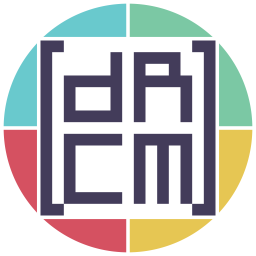

# drcm

  

dR Community Matrix (dRCM) is a space for people interested in chatting with the fellows from devrant.com as they are. It is supposed to have enhanced code of conduct and membership screening for coming members.

As we move on, more repositories will be attached to [drcmatrix at github.com](https://github.com/drcmatrix), probably. Right now you are presented with these open projects:
- [drcmatrix/drcm](https://github.com/drcmatrix/drcm) (this one),
- [drcmatrix/drcm-bot](https://github.com/drcmatrix/drcm-bot).

## Questions

### May I enter dRCM?

dRCM is at pre-alpha state, but if you are interested, just say to [@vintprox:matrix.org](https://matrix.to/#/@vintprox:matrix.org). As we run beta, you will need to pass a simple Membership Screening, as all Coming Members.

### What is Membership Screening?

Membership Screening (MS) is one very crucial procedure, since we plan to introduce dRCM to devrant.com users. There may be few troublemakers, as it happens with all Internet places, so each Coming Member must pass MS to be allowed in dRCM. This procedure includes a familiarization with [dRCM Code of Conduct](./CODE.md), but isn't limited to it.

Behind the curtains, some random Head Member is chosen to perform screening of the Coming Member. Membership Screening is supposed to be arranged via intermediary (which is dCRM Bot), to retain an anonymity of Screener, and to allow better provenance and audit.

### Is this a server and how my data is used?

dRCM is a space, that is a mere entity of the server. And as stated by dRCM Code of Conduct, our space is situated at matrix.org, the official Matrix homeserver. Hosting our own homeserver by the means of compromising performance would be a bother anyway: our group isn't as big as words in the [Code](./CODE.md) that might give you such an idea, and we would not like to own your data.

We'd better off relying on existing infrastructure and introducing you to [Matrix.org Homeserver Terms and Conditions](https://matrix.org/legal/terms-and-conditions). dRCM Bot has its own set of data about All Members: to familiarize with it, read [dRCM Code of Conduct](./CODE.md).

### Why I See A Lot Of Capitalized Words?

If you see phrases that were put through capitalization rules in dRCM-related notes, there is most likely a common meaning behind them and they are listed in [Code Taxonomy](./CODE.md). Once you find an ambiguity, please tell us.
