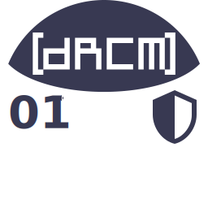
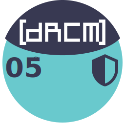
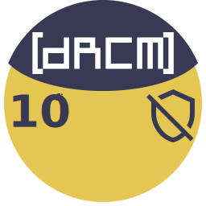
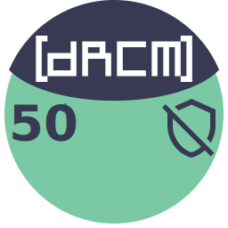
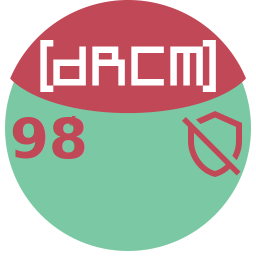
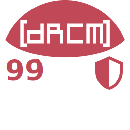

# rooms

These are the logos for each single room. SVG files follow the same structure, and only a pinch of values is different between them.

     

## Room logo values

### Base name

Base name of each file should be the same as according room's localpart from address. Example: `drcm-00-name` for `#drcm-00-name:matrix.org`, and SVG file's name would be `drcm-00-name.svg`.

### Foreground

Foreground color represents an access level to the room. Only 2 are present:
- <code style="background: #383952; color: white;">#383952</code> - Accepted Members,
- <code style="background: #c14857; color: white;">#c14857</code> - Head Members.

### Background

Background color represents a subjective similarity of the room in a group with other ones. We have few categories right now:
- <code style="background: #ffffff; color: black;">#ffffff</code> - lobby type,
- <code style="background: #69c9cd; color: black;">#69c9cd</code> - intel type,
- <code style="background: #e6c653; color: black;">#e6c653</code> - fun type,
- <code style="background: #7bc8a4; color: black;">#7bc8a4</code> - experimental type.

### Number

We follow strict 2-digit enumeration, which is also reflected on each file's base name. Replace the old one with needed room's number.

### Icon

Main icon should deliver a purpose of the room. We use [Material Design Icons](https://materialdesignicons.com/) for this:
1. find an appropriate icon,
2. copy contents from "SVG Viewer"/"Inline SVG for HTML" embedded on their website,
3. replace old icon with the copied contents.

### E2E

Shield icon on the right is supposed to tell if the room has E2E encryption.
- `#e2e-off` - no encryption,
- `#e2e-on` - E2EE room.
